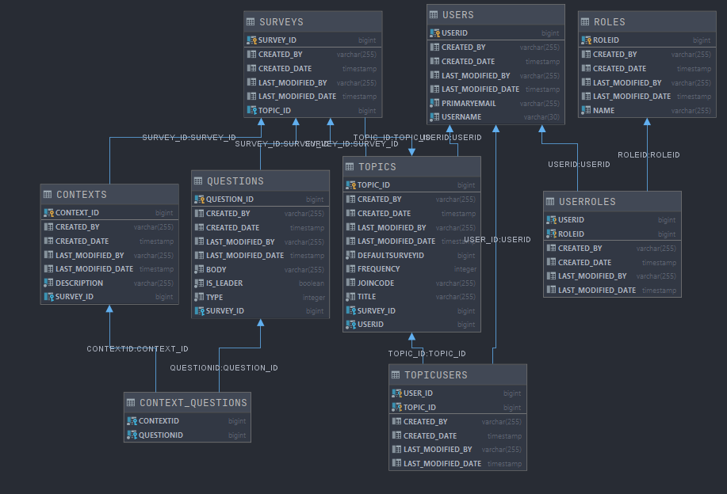

# Apollo API

### Getting a JWT

<details>

<summary>Instructions for getting a JWT for hitting the endpoints</summary>

once you have signed in through okta on the [client]("https://github.com/Lambda-School-Labs/Labs26-Apollo-FE-TeamB") do
```JS
let tokenObj = JSON.parse(localStorage.getItem("okta-token-storage"));
```

```JS
tokenObj.accessToken.value
```


Ok so now that you have copied that idtoken property head over to postman, and in the auth tab select barer token and paste in the token.


</details>

### Local Development Setup

<details>

<summary>When working with the api locally you may configure env variables to make testing easier</summary>


</details>


### Database layout

<details>
<summary> Image of Database Layout </summary>


</details>

### Endpoints:

## Topics

<details>

<summary>POST: http://apollo-b-api.herokuapp.com/topics/new - create a new topic</summary>

Creates a Topic with the current user as the owner.

Expected body
```JSON
{
    "title": "My New Topic",
    "frequency": "WEEKLY",
    "defaultsurvey": {
        "questions": [
                    {
                        "body": "Do you have any blockers?",
                        "type": "TEXT",
                        "leader": true
                    },
                    {
                        "body": "What is the teams priority?",
                        "type": "TEXT",
                        "leader": true
                    },
                    {
                        "body": "How is your weekend?",
                        "type": "TEXT",
                        "leader": false
                    }
        ]
    }
}

```

Response

```JSON
{
    "topicid": 62,
    "title": "My New Topic",
    "owner": {
        "userid": 10,
        "username": "llama001@maildrop.cc"
    },
    "frequency": "WEEKLY",
    "defaultsurvey": {
        "surveyid": 63,
        "questions": [
            {
                "questionId": 64,
                "body": "Do you have any blockers?",
                "type": "TEXT",
                "leader": true
            },
            {
                "questionId": 65,
                "body": "What is the teams priority?",
                "type": "TEXT",
                "leader": true
            },
            {
                "questionId": 66,
                "body": "How is your weekend?",
                "type": "TEXT",
                "leader": false
            }
        ]
    },
    "joincode": "QkJlKGwYM",
    "surveysrequests": [],
    "users": []
}
```
</details>

<details>

<summary>DELETE: http://apollo-b-api.herokuapp.com/topics/leave/{topicid} - leave topic</summary>

User leaves topic.

</details>

<details>

<summary>GET: http://apollo-b-api.herokuapp.com/topics/topics - Get all topics for a user</summary>

Returns all topics that a user is connected to, either as an owner or as a member

GET Endpoint

```JSON
[
    {
        "topicid": 37,
        "title": "Topic 2",
        "owner": {
            "userid": 4,
            "username": "admin"
        },
        "frequency": "MONDAY",
        "defaultsurvey": {
            "surveyid": 36,
            "questions": []
        },
        "joincode": "lRQlkNGkg",
        "surveysrequests": [
            {
                "surveyid": 46,
                "questions": [
                    {
                        "questionId": 56,
                        "body": "Leader Question 1",
                        "type": "TEXT",
                        "leader": true
                    },
                    {
                        "questionId": 58,
                        "body": "Leader Question 2",
                        "type": "TEXT",
                        "leader": true
                    },
                    {
                        "questionId": 59,
                        "body": "Member Question 1",
                        "type": "TEXT",
                        "leader": false
                    }
                ]
            },
            {
                "surveyid": 57,
                "questions": []
            }
        ],
        "users": [
            {
                "user": {
                    "userid": 5,
                    "username": "cinnamon"
                }
            },
            {
                "user": {
                    "userid": 10,
                    "username": "llama001@maildrop.cc"
                }
            }
        ]
    },
    {
        "topicid": 62,
        "title": "My New Topic",
        "owner": {
            "userid": 10,
            "username": "llama001@maildrop.cc"
        },
        "frequency": "WEEKLY",
        "defaultsurvey": {
            "surveyid": 63,
            "questions": [
                {
                    "questionId": 64,
                    "body": "Do you have any blockers?",
                    "type": "TEXT",
                    "leader": true
                },
                {
                    "questionId": 65,
                    "body": "What is the teams priority?",
                    "type": "TEXT",
                    "leader": true
                },
                {
                    "questionId": 66,
                    "body": "How is your weekend?",
                    "type": "TEXT",
                    "leader": false
                }
            ]
        },
        "joincode": "QkJlKGwYM",
        "surveysrequests": [
            {
                "surveyid": 63,
                "questions": [
                    {
                        "questionId": 64,
                        "body": "Do you have any blockers?",
                        "type": "TEXT",
                        "leader": true
                    },
                    {
                        "questionId": 65,
                        "body": "What is the teams priority?",
                        "type": "TEXT",
                        "leader": true
                    },
                    {
                        "questionId": 66,
                        "body": "How is your weekend?",
                        "type": "TEXT",
                        "leader": false
                    }
                ]
            }
        ],
        "users": []
    }
]
```

</details>

<details>

<summary>POST: http://appollo-b-api.herokuapp.com/topics/topic/{joinCode} Current user joins a Topic.</summary>

Example: http://appollo-b-api.herokuapp.com/topics/topic/lRQlkNGkg

Returns 200 Success message

</details>

<details>
<summary>GET: http://appollo-b-api.herokuapp.com/topics/all Returns list of all Topics regardless of user</summary>

N/A

</details>

<details>
<summary>GET: http://localhost:2019/topics/topic/{topicid} Returns a specific topic</summary>

Example : http://appollo-b-api.herokuapp.com/topics/topic/37

</details>

<details>

<summary>DELETE: http://apollo-b-api.herokuapp.com/topics/topic/{topicid} - delete topic</summary>

Delete topic as well as all surveys, questions, responses associated with it.

</details>

## Users

<details>

<summary>GET: http://apollo-b-api.herokuapp.com/users/getuserinfo Returns user info included topics of which they are a member</summary>

Example:

```JSON
{
    "userid": 10,
    "username": "llama001@maildrop.cc",
    "ownedtopics": [
        {
            "topicid": 62,
            "title": "My New Topic",
            "frequency": "WEEKLY",
            "defaultsurvey": {
                "surveyid": 63,
                "questions": [
                    {
                        "questionId": 64,
                        "body": "Do you have any blockers?",
                        "type": "TEXT",
                        "leader": true
                    },
                    {
                        "questionId": 65,
                        "body": "What is the teams priority?",
                        "type": "TEXT",
                        "leader": true
                    },
                    {
                        "questionId": 66,
                        "body": "How is your weekend?",
                        "type": "TEXT",
                        "leader": false
                    }
                ]
            },
            "joincode": "QkJlKGwYM",
            "surveysrequests": [
                {
                    "surveyid": 63,
                    "questions": [
                        {
                            "questionId": 64,
                            "body": "Do you have any blockers?",
                            "type": "TEXT",
                            "leader": true
                        },
                        {
                            "questionId": 65,
                            "body": "What is the teams priority?",
                            "type": "TEXT",
                            "leader": true
                        },
                        {
                            "questionId": 66,
                            "body": "How is your weekend?",
                            "type": "TEXT",
                            "leader": false
                        }
                    ]
                }
            ]
        }
    ],
    "topics": [
        {
            "topic": {
                "topicid": 37,
                "title": "Topic 2",
                "owner": {
                    "userid": 4,
                    "username": "admin"
                },
                "frequency": "MONDAY",
                "defaultsurvey": {
                    "surveyid": 36,
                    "questions": []
                },
                "joincode": "lRQlkNGkg",
                "surveysrequests": [
                    {
                        "surveyid": 46,
                        "questions": [
                            {
                                "questionId": 56,
                                "body": "Leader Question 1",
                                "type": "TEXT",
                                "leader": true
                            },
                            {
                                "questionId": 58,
                                "body": "Leader Question 2",
                                "type": "TEXT",
                                "leader": true
                            },
                            {
                                "questionId": 59,
                                "body": "Member Question 1",
                                "type": "TEXT",
                                "leader": false
                            }
                        ]
                    },
                    {
                        "surveyid": 57,
                        "questions": []
                    }
                ]
            }
        }
    ]
}

```

</details>


## Surveys
<details>

<summary>GET: http://apollo-b-api.herokuapp.com/surveys/all Returns list of surveys</summary>

```JSON
[
    {
        "surveyid": 36,
        "topic": null,
        "defaulttopic": [
            {
                "topicId": 37,
                "title": "Topic 2",
                "owner": {
                    "userid": 4,
                    "username": "admin"
                },
                "frequency": "MONDAY",
                "joincode": "46mZD66zk"
            }
        ],
        "questions": [],
        "responded": false,
        "surveyId": 36
    },
    {
        "surveyid": 38,
        "topic": null,
        "defaulttopic": [
            {
                "topicId": 39,
                "title": "Topic 3",
                "owner": {
                    "userid": 5,
                    "username": "cinnamon"
                },
                "frequency": "WEEKLY",
                "joincode": "08qZy889N"
            }
        ],
        "questions": [],
        "responded": false,
        "surveyId": 38
    },
    {
        "surveyid": 40,
        "topic": null,
        "defaulttopic": [
            {
                "topicId": 41,
                "title": "Topic 4",
                "owner": {
                    "userid": 5,
                    "username": "cinnamon"
                },
                "frequency": "WEEKLY",
                "joincode": "oZRz9ZZOL"
            }
        ],
        "questions": [],
        "responded": false,
        "surveyId": 40
    },
    {
        "surveyid": 42,
        "topic": null,
        "defaulttopic": [
            {
                "topicId": 43,
                "title": "Topic 5",
                "owner": {
                    "userid": 5,
                    "username": "cinnamon"
                },
                "frequency": "MONTHLY",
                "joincode": "r2ZDN22YL"
            }
        ],
        "questions": [],
        "responded": false,
        "surveyId": 42
    },
    {
        "surveyid": 44,
        "topic": null,
        "defaulttopic": [
            {
                "topicId": 45,
                "title": "Topic 6",
                "owner": {
                    "userid": 5,
                    "username": "cinnamon"
                },
                "frequency": "MONTHLY",
                "joincode": "x6qMN66lP"
            }
        ],
        "questions": [],
        "responded": false,
        "surveyId": 44
    },
    {
        "surveyid": 46,
        "topic": {
            "topicId": 37,
            "title": "Topic 2",
            "frequency": "MONDAY",
            "defaultsurvey": {
                "surveyid": 36,
                "questions": [],
                "responded": false,
                "surveyId": 36
            },
            "joincode": "46mZD66zk"
        },
        "defaulttopic": [],
        "questions": [
            {
                "body": "Leader Question 1",
                "type": "TEXT",
                "answers": [],
                "questionId": 57,
                "leader": true
            },
            {
                "body": "Leader Question 2",
                "type": "TEXT",
                "answers": [],
                "questionId": 58,
                "leader": true
            },
            {
                "body": "Member Question 1",
                "type": "TEXT",
                "answers": [],
                "questionId": 59,
                "leader": false
            }
        ],
        "responded": false,
        "surveyId": 46
    },
    {
        "surveyid": 47,
        "topic": {
            "topicId": 39,
            "title": "Topic 3",
            "frequency": "WEEKLY",
            "defaultsurvey": {
                "surveyid": 38,
                "questions": [],
                "responded": false,
                "surveyId": 38
            },
            "joincode": "08qZy889N"
        },
        "defaulttopic": [],
        "questions": [
            {
                "body": "Member Question 2",
                "type": "TEXT",
                "answers": [],
                "questionId": 60,
                "leader": false
            },
            {
                "body": "Member Question 3",
                "type": "TEXT",
                "answers": [],
                "questionId": 61,
                "leader": false
            }
        ],
        "responded": false,
        "surveyId": 47
    },
    {
        "surveyid": 48,
        "topic": {
            "topicId": 41,
            "title": "Topic 4",
            "frequency": "WEEKLY",
            "defaultsurvey": {
                "surveyid": 40,
                "questions": [],
                "responded": false,
                "surveyId": 40
            },
            "joincode": "oZRz9ZZOL"
        },
        "defaulttopic": [],
        "questions": [],
        "responded": false,
        "surveyId": 48
    },
    {
        "surveyid": 49,
        "topic": {
            "topicId": 43,
            "title": "Topic 5",
            "frequency": "MONTHLY",
            "defaultsurvey": {
                "surveyid": 42,
                "questions": [],
                "responded": false,
                "surveyId": 42
            },
            "joincode": "r2ZDN22YL"
        },
        "defaulttopic": [],
        "questions": [],
        "responded": false,
        "surveyId": 49
    },
    {
        "surveyid": 50,
        "topic": {
            "topicId": 45,
            "title": "Topic 6",
            "frequency": "MONTHLY",
            "defaultsurvey": {
                "surveyid": 44,
                "questions": [],
                "responded": false,
                "surveyId": 44
            },
            "joincode": "x6qMN66lP"
        },
        "defaulttopic": [],
        "questions": [],
        "responded": false,
        "surveyId": 50
    },
    {
        "surveyid": 52,
        "topic": {
            "topicId": 37,
            "title": "Topic 2",
            "frequency": "MONDAY",
            "defaultsurvey": {
                "surveyid": 36,
                "questions": [],
                "responded": false,
                "surveyId": 36
            },
            "joincode": "46mZD66zk"
        },
        "defaulttopic": [],
        "questions": [],
        "responded": false,
        "surveyId": 52
    }
]
```

</details>

<details>

<summary>GET: http://apollo-b-api.herokuapp.com/surveys/survey/{id} Returns survey by id</summary>

```JSON
{
    "surveyid": 48,
    "topic": {
        "topicId": 41,
        "title": "Topic 4",
        "frequency": "WEEKLY",
        "defaultsurvey": {
            "surveyid": 40,
            "questions": [],
            "responded": false,
            "surveyId": 40
        },
        "joincode": "oZRz9ZZOL"
    },
    "defaulttopic": [],
    "questions": [],
    "responded": false,
    "surveyId": 48
}
```

</details>

## Questions
<details>

<summary>GET: http://apollo-b-api.herokuapp.com/questions/all Returns list of questions</summary>

```JSON
[
    {
        "questionId": 51,
        "body": "Leader Question 1",
        "type": "TEXT",
        "survey": {
            "surveyid": 41,
            "topic": {
                "topicid": 35,
                "title": "Topic 1",
                "frequency": "MONDAY"
            }
        },
        "leader": true
    },
    {
        "questionId": 52,
        "body": "Leader Question 2",
        "type": "TEXT",
        "survey": {
            "surveyid": 41,
            "topic": {
                "topicid": 35,
                "title": "Topic 1",
                "frequency": "MONDAY"
            }
        },
        "leader": true
    },
    {
        "questionId": 53,
        "body": "Member Question 1",
        "type": "TEXT",
        "survey": {
            "surveyid": 41,
            "topic": {
                "topicid": 35,
                "title": "Topic 1",
                "frequency": "MONDAY"
            }
        },
        "leader": false
    },
    {
        "questionId": 54,
        "body": "Member Question 2",
        "type": "TEXT",
        "survey": {
            "surveyid": 42,
            "topic": {
                "topicid": 35,
                "title": "Topic 1",
                "frequency": "MONDAY"
            }
        },
        "leader": false
    },
    {
        "questionId": 55,
        "body": "Member Question 3",
        "type": "TEXT",
        "survey": {
            "surveyid": 42,
            "topic": {
                "topicid": 35,
                "title": "Topic 1",
                "frequency": "MONDAY"
            }
        },
        "leader": false
    }
]

```

</details>


<details>

<summary>GET: http://apollo-b-api.herokuapp.com/questions/leader/{surveyid} Returns list of leader questions for a given survey</summary>

```JSON
[
    {
        "createdDate": "2020-10-02 13:26:25",
        "lastModifiedDate": "2020-10-02 13:26:25",
        "body": "Leader Question 1",
        "type": "TEXT",
        "survey": {
            "createdDate": "2020-10-02 13:26:25",
            "lastModifiedDate": "2020-10-02 13:26:25",
            "surveyid": 46,
            "responded": false,
            "surveyId": 46
        },
        "answers": [],
        "leader": true,
        "questionId": 57
    },
    {
        "createdDate": "2020-10-02 13:26:25",
        "lastModifiedDate": "2020-10-02 13:26:25",
        "body": "Leader Question 2",
        "type": "TEXT",
        "survey": {
            "createdDate": "2020-10-02 13:26:25",
            "lastModifiedDate": "2020-10-02 13:26:25",
            "surveyid": 46,
            "responded": false,
            "surveyId": 46
        },
    }
]
```

</details>

## Context

<details>
<summary> GET http://apollo-b-api.herokuapp.com/contexts/contexts - Returns all of the contexts</summary>

Extra details here

```JSON
[
    {
        "description": "product leadership",
        "survey": {
            "questions": [
                {
                    "body": "Leader Question 1",
                    "type": "TEXT",
                    "answers": [],
                    "questionId": 56,
                    "leader": true
                },
                {
                    "body": "Leader Question 2",
                    "type": "TEXT",
                    "answers": [],
                    "questionId": 58,
                    "leader": true
                },
                {
                    "body": "Member Question 1",
                    "type": "TEXT",
                    "answers": [],
                    "questionId": 59,
                    "leader": false
                }
            ],
            "surveyId": 46
        },
        "contextId": 51
    },
    {...},
    {...}
]
```

</details>

<details>
<summary>POST http://apollo-b-api.herokuapp.com Create a new context </summary>

Expected JSON in the body of the post


```JSON
{
    "description": "Super Duper Cool leadership v 9",
    "survey": {
        "questions": [
            {
                "body": "What is the highest priority for the current sprint",
                "type": "TEXT",
                "leader": true
            },
            {
                "body": "What is my availability for the current sprint?",
                "type": "TEXT",
                "leader": true
            },
            {
                "body": "Do you have any blockers?",
                "type": "TEXT",
                "leader": false
            },
            {
                "body": "Will you be working remote?",
                "type": "TEXT",
                "leader": false
            }
        ]
    }
}

```

</details>

## Survey Requests

<details>
<summary> POST  http://apollo-b-api.herokuapp.com/surveys/topic/{topicid} - Create Survey Request</summary>
Example - http://apollo-b-api.herokuapp.com/surveys/topic/37 - (this endpoint won't work in this patch because the owner is username 'admin' with userid of 4)
To test locally or with the api - I recommend logging in as a test user and creating a topic, then using the topic id to create a survey request
If you try to make this request not being the owner of the topic you will get this error message - ("Current user not authorized to make this request")

This is the format of data we are expecting to receive

```JSON
[
    {
        "body": "Do you have any blockers?",
        "type": "TEXT",
        "leader": true,
        "answer" : "LEADER ANSWER HERE"
    },
    {
        "body": "What is the teams priority?",
        "type": "TEXT",
        "leader": true,
        "answer" : "LEADER ANSWER HERE"
    },
    {
        "body": "How is your weekend?",
        "type": "TEXT",
        "leader": false
    }
]

```

This is a successful response

```JSON
{
    "topic": {
        "topicId": 37,
        "title": "Topic 2",
        "joincode": "qQRBovxGD"
    },
    "questions": [
        {
            "body": "Do you have any blockers?",
            "type": "TEXT",
            "answers": [
                {
                    "body": "LEADER ANSWER HERE",
                    "answerId": 64
                }
            ],
            "questionId": 63,
            "leader": true
        },
        {
            "body": "What is the teams priority?",
            "type": "TEXT",
            "answers": [
                {
                    "body": "LEADER ANSWER HERE",
                    "answerId": 66
                }
            ],
            "questionId": 65,
            "leader": true
        },
        {
            "body": "How is your weekend?",
            "type": "TEXT",
            "answers": [],
            "questionId": 67,
            "leader": false
        }
    ],
    "surveyId": 62
}
```

</details>

<details>
<summary>  GET http://apollo-b-api.herokuapp.com/surveys/survey/172/responses - Returns a list of all answers to a Survey </summary>

```JSON
[
    {
        "createdDate": "2020-09-29 10:09:51",
        "lastModifiedDate": "2020-09-29 10:09:51",
        "body": "LEADER ANSWER HERE",
        "question": {
            "createdDate": "2020-09-29 10:09:51",
            "lastModifiedDate": "2020-09-29 10:09:51",
            "body": "Do you have any blockers?",
            "type": "TEXT",
            "questionId": 173,
            "leader": true
        },
        "user": {
            "createdDate": "2020-09-24 11:52:27",
            "lastModifiedDate": "2020-09-24 11:52:27",
            "userid": 4,
            "username": "admin"
        },
        "answerId": 174
    },
    {
        "createdDate": "2020-09-29 10:09:51",
        "lastModifiedDate": "2020-09-29 10:09:51",
        "body": "ANOTHER LEADER ANSWER HERE",
        "question": {
            "createdDate": "2020-09-29 10:09:51",
            "lastModifiedDate": "2020-09-29 10:09:51",
            "body": "What is the teams priority?",
            "type": "TEXT",
            "questionId": 175,
            "leader": true
        },
        "user": {
            "createdDate": "2020-09-24 11:52:27",
            "lastModifiedDate": "2020-09-24 11:52:27",
            "userid": 4,
            "username": "admin"
        },
        "answerId": 176
    }
]

```

</details>


## Messages

## Answers
