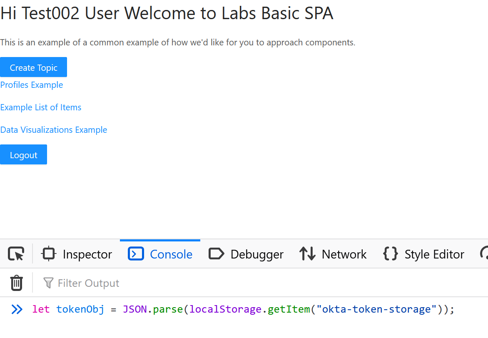

# Apollo API

### Getting a JWT

once you have signed in through okta on the [client]("https://github.com/Lambda-School-Labs/Labs26-Apollo-FE-TeamB") do
```JS
let tokenObj = JSON.parse(localStorage.getItem("okta-token-storage"));
```

```JS
tokenObj.accessToken
```


Ok so now that you have copied that idtoken property head over to postman, and in the auth tab select barer token and paste in the token.


Api will be extended

### Database layout

Table layout will be provide here once finalized

### Endpoints:

<details>
<summary>http://{urlhere}/topics/topics</summary>

GET Endpoint

```JSON
[
    {
        "topicId": 49,
        "title": "Topic 1",
        "owner": {
            "userid": 4,
            "username": "admin",
            "primaryemail": "admin@lambdaschool.local",
            "roles": [
                {
                    "role": {
                        "roleid": 1,
                        "name": "ADMIN"
                    }
                },
                {
                    "role": {
                        "roleid": 2,
                        "name": "USER"
                    }
                },
                {
                    "role": {
                        "roleid": 3,
                        "name": "DATA"
                    }
                }
            ]
        },
        "survey": {
            "surveyId": 34
        },
        "users": []
    },
    {
        "topicId": 50,
        "title": "Topic 2",
        "owner": {
            "userid": 4,
            "username": "admin",
            "primaryemail": "admin@lambdaschool.local",
            "roles": [
                {
                    "role": {
                        "roleid": 1,
                        "name": "ADMIN"
                    }
                },
                {
                    "role": {
                        "roleid": 2,
                        "name": "USER"
                    }
                },
                {
                    "role": {
                        "roleid": 3,
                        "name": "DATA"
                    }
                }
            ]
        },
        "survey": {
            "surveyId": 35
        },
        "users": []
    },
    {
        "topicId": 51,
        "title": "Topic 3",
        "owner": {
            "userid": 5,
            "username": "cinnamon",
            "primaryemail": "cinnamon@lambdaschool.local",
            "roles": [
                {
                    "role": {
                        "roleid": 3,
                        "name": "DATA"
                    }
                },
                {
                    "role": {
                        "roleid": 2,
                        "name": "USER"
                    }
                }
            ]
        },
        "survey": {
            "surveyId": 34
        },
        "users": []
    },
    {
        "topicId": 52,
        "title": "Topic 4",
        "owner": {
            "userid": 5,
            "username": "cinnamon",
            "primaryemail": "cinnamon@lambdaschool.local",
            "roles": [
                {
                    "role": {
                        "roleid": 3,
                        "name": "DATA"
                    }
                },
                {
                    "role": {
                        "roleid": 2,
                        "name": "USER"
                    }
                }
            ]
        },
        "survey": {
            "surveyId": 36
        },
        "users": []
    },
    {
        "topicId": 53,
        "title": "Topic 5",
        "owner": {
            "userid": 5,
            "username": "cinnamon",
            "primaryemail": "cinnamon@lambdaschool.local",
            "roles": [
                {
                    "role": {
                        "roleid": 3,
                        "name": "DATA"
                    }
                },
                {
                    "role": {
                        "roleid": 2,
                        "name": "USER"
                    }
                }
            ]
        },
        "survey": {
            "surveyId": 37
        },
        "users": []
    },
    {
        "topicId": 54,
        "title": "Topic 6",
        "owner": {
            "userid": 5,
            "username": "cinnamon",
            "primaryemail": "cinnamon@lambdaschool.local",
            "roles": [
                {
                    "role": {
                        "roleid": 3,
                        "name": "DATA"
                    }
                },
                {
                    "role": {
                        "roleid": 2,
                        "name": "USER"
                    }
                }
            ]
        },
        "survey": {
            "surveyId": 34
        },
        "users": []
    }
]
```

</details>
